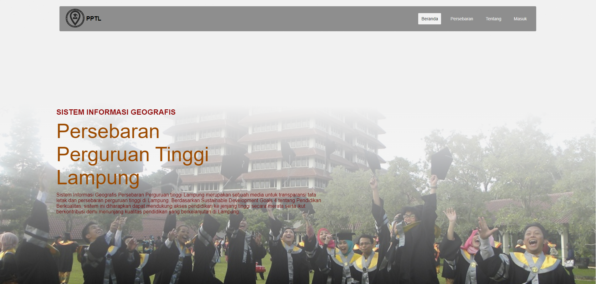
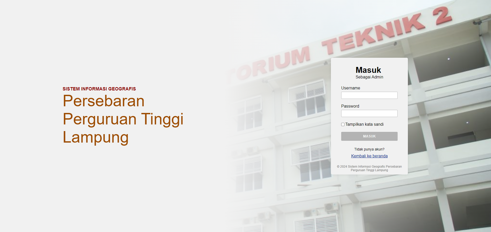

# Sistem Informasi Geografis: Persebaran Perguruan Tinggi Lampung (SIG:PPTL)



Sistem Informasi Geografis Persebaran Perguruan tinggi Lampung merupakan sebuah media untuk transparansi tata letak dan persebaran perguruan tinggi di Lampung. Berdasarkan Sustainable Development Goals 4 tentang Pendidikan Berkualitas, sistem ini diharapkan dapat mendukung akses pendidikan ke jenjang tinggi secara merata serta ikut berkontribusi demi menunjang kualitas pendidikan yang berkelanjutan di Lampung.

## Fitur

1. Informasi daftar perguruan tinggi di Lampung.


2. Denah persebaran perguruan perguruan tinggi di Lampung.


3. Masuk sebagai Admin.



4. Kelola data perguruan perguruan tinggi (Admin).

- Halaman Utama Admin <br /> 

- Edit Perguruan Tinggi <br /> 

- Iput Perguruan Tinggi <br /> 

## Tech Stack

- [ReactJS](https://reactjs.org/)
- [Nest Js](https://nestjs.com/)
- [QGIS](https://qgis.org/)
- [LeafletJS](https://leafletjs.com/)
- [PostgreSQL](https://www.postgresql.org/)

## Pengembang

| No  | Nama Kontributor            | NIM       | Kontribusi     |
| --- | --------------------------- | --------- | -------------- |
| 1.  | Muhammad Muslim Nur Wahyudi | 120140008 | Backend        |
| 2.  | Muhammad Alhafiz            | 120140108 | Frontend       |
| 3.  | Tegar Abimanyu              | 120140112 | Data Engineer  |
| 4.  | Daniel Albertus Turnip      | 120140140 | UI/UX Designer |
| 5.  | Ichza Auliya Gumilar        | 120140188 | QA             |
| 6.  | Hafiz Amrullah              | 119140177 | System Design  |

## Instalasi

> [!IMPORTANT]
> Pastikan anda sudah menginstall [NodeJS](https://nodejs.org/en/) dan [NPM](https://www.npmjs.com/) atau [PNPM](https://pnpm.io/). Sistem ini berjalan dengan secara masksimal hanya jika sistem [ini](https://github.com/limnwhyy/SIG-PPTL-BE.git) juga dijalankan.

1. Clone repository ini

```
git clone https://github.com/limnwhyy/SIG-PPTL-FE.git
```

2. Masuk ke direktori project

```
cd SIG-PPTL-FE
```

3. Install dependencies

```
pnpm install
```

4. Jalankan aplikasi

```
pnpm run dev
```
